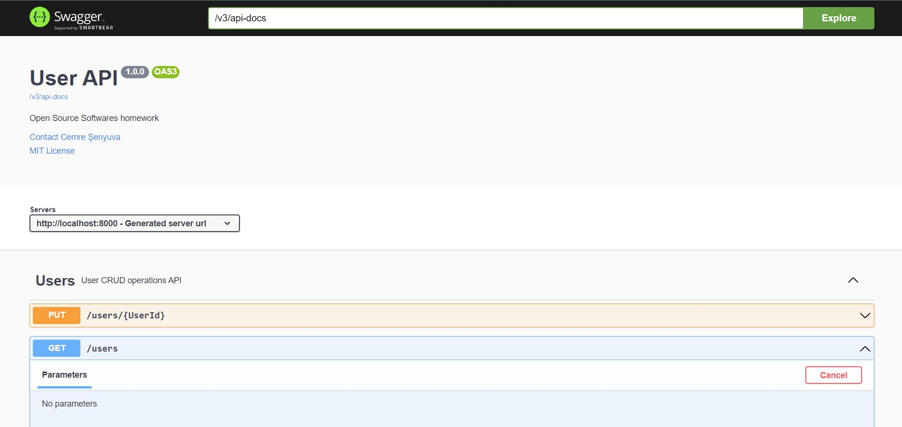

# spring-boot-docker

This is a user registeration API with Spring Boot. There are CRUD operations.
Open Source Software lesson homework.

Docker image available on [Docker Hub](https://hub.docker.com/repository/docker/cemresenyuva/spring-boot-docker/general)

## How To Run

After cloning and installing this repository go to the directory where the project is installed.

```bash
  docker build -t springapi .
  docker run -p 8000:8080 springapi
```

After that you can try API's on [http://localhost:8000/swagger-ui/index.html](http://localhost:8000/swagger-ui/index.html)
And you can see the docs on [http://localhost:8000/v3/api-docs](http://localhost:8000/v3/api-docs)

## Screenshots




## License

[MIT](https://choosealicense.com/licenses/mit/)

